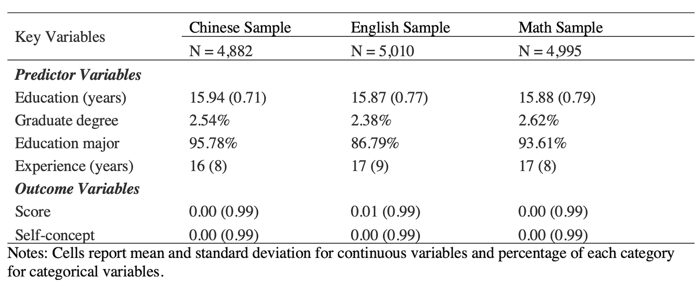
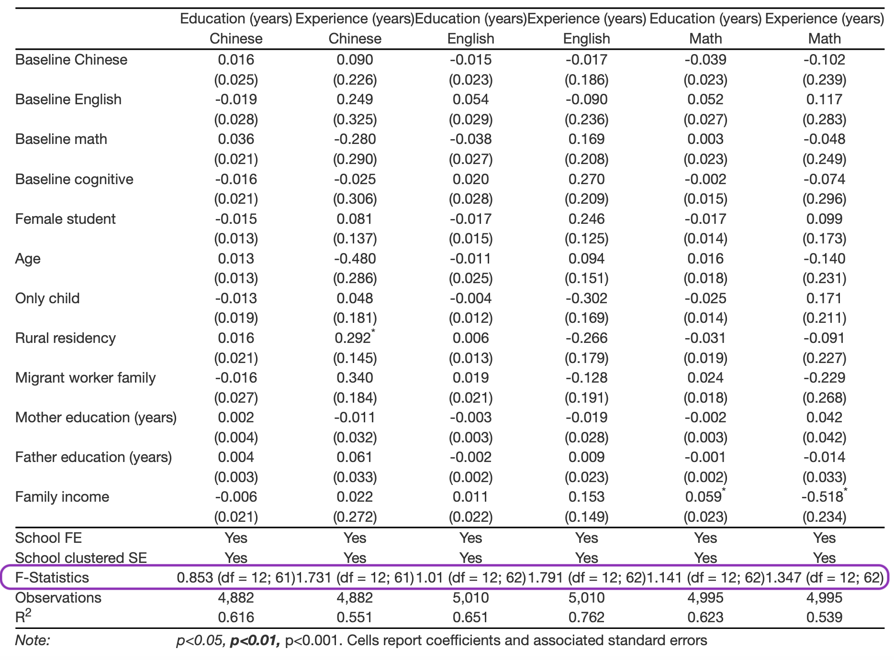
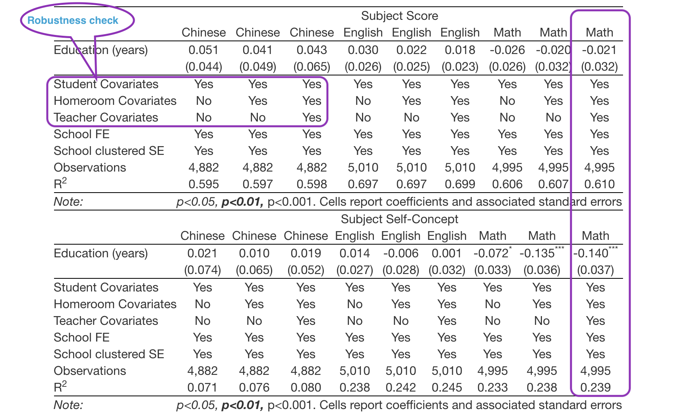
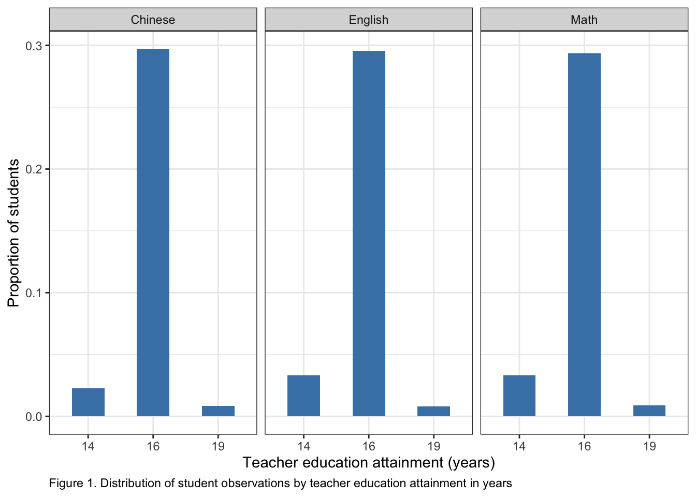
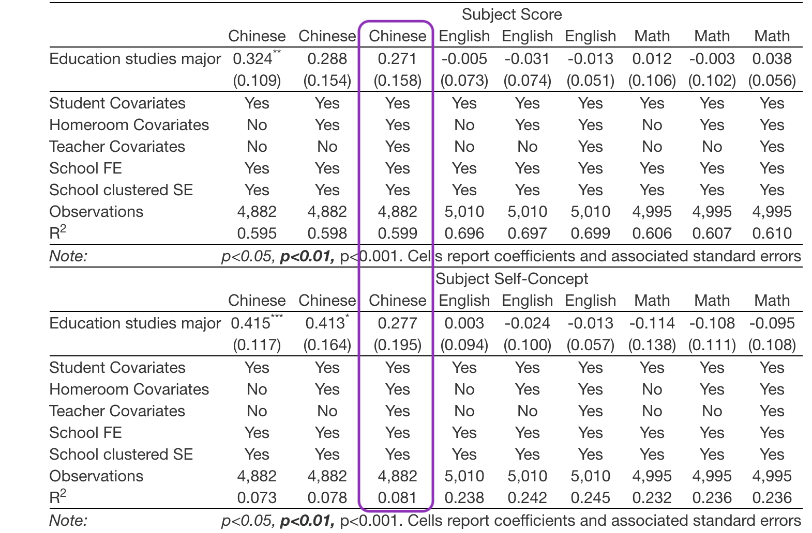
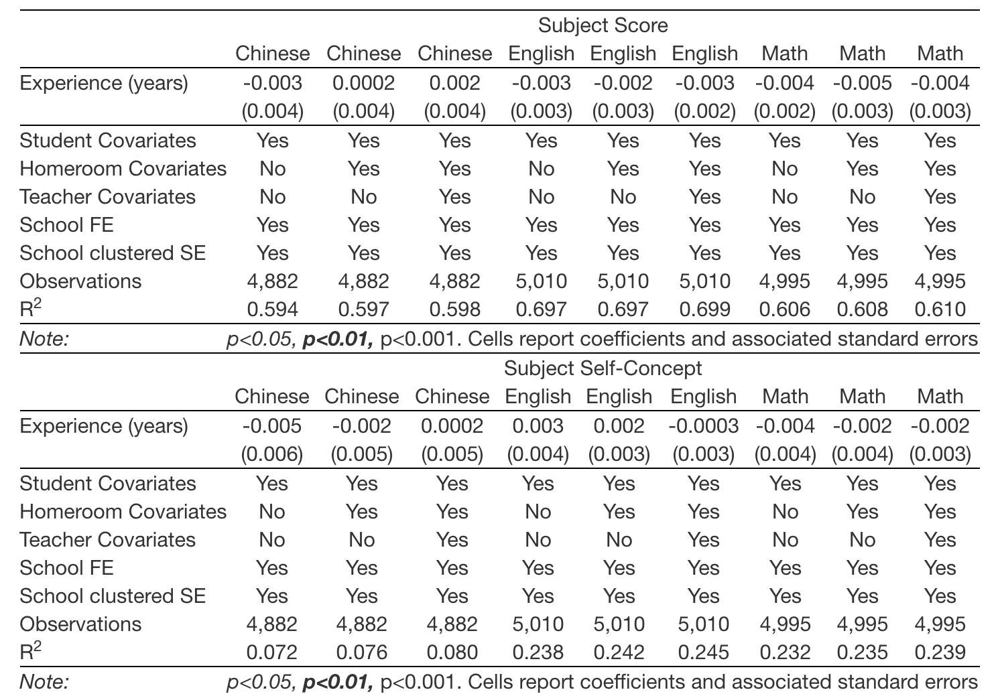
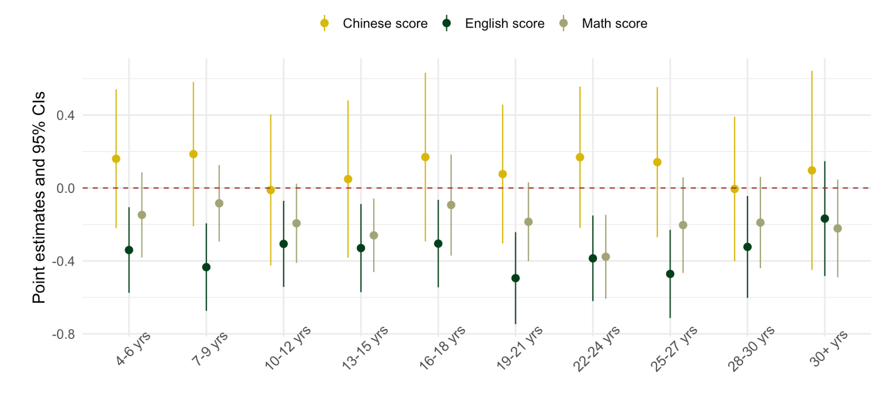
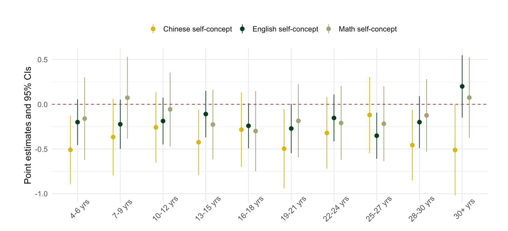

```{r setup, include=FALSE}
options(htmltools.dir.version = FALSE)
xaringanExtra::use_editable(expires = 1)
```

```{r xaringan-themer, include=FALSE, warning=FALSE}
library(xaringanthemer)
style_mono_light(base_color = "#3b586c",
                 base_font_size = "20px",
                 header_h1_font_size = "2.10rem",
                 header_h2_font_size = "1.80rem")
```

# Agenda

 - .highlighter01[Introduction]
   
 - .highlighter01[Data and Measures] 
 
 - .highlighter01[Methods]
 
 - .highlighter01[Results]
 
 - .highlighter01[Discussion]

---
class: center, middle
background-image: url(back01.png)
background-size: cover
# INTRODUCTION

---
## Why teacher human capital characteristics

Teacher human capital characteristics (such as .highlighter01[education background] and .highlighter01[teaching experience]) are widely used in human resources decisions across the world

.highlighter03[Qualities of human capital characteristics:
 - objective, straightforward, and easily accessible in teacher's profile
 - can be clearly categorized by certain policy thresholds
 - practically and computationally cheaper than other teacher quality measures 
    - e.g., value-added to student performance, classroom observations, principal/student/parent ratings, etc.]

Characteristics-based human resources policies assume that teachers with stronger human capital profile are better teachers, 

 - which is unfortunately .highlighter02[NOT] supported by scientific research (Hanushek, 2011).

---
## Literature review
.highlighter01[Teacher education]:
 - Teacher education attainment, major, and training programs do not add to student learning (Aaronson et al., 2007)
 - Math teachers holding graduate-level degree positively impact student performance (Coenen et al., 2018; Guarino et al., 2013)

.highlighter01[Teaching experience]:
 - No reliable relationship between teaching experience measured in years and student performance (Aaronson et al., 2007; Hanushek, 2011)
 - Non-linearity in experience effects (Clotfelter et al., 2006; Hanushek, 2011): return to experience is strongest in a teacher’s early career (e.g., within five years, Papay and Kraft, 2015; Rice, 2013), then levels off (Kane et al., 2008; Rockoff, 2004)
 - Experience effects differ across levels of schooling (Harris and Sass, 2011) and subject areas (e.g., effects are larger for math than reading, see Clotfelter et al., 2007)

---
## Research questions

1. Whether and to what extent teacher .highlighter01[education background] affects student academic performance and self-concept?

2. Whether and to what extent teacher .highlighter01[teaching experience] affects student academic performance and self-concept?

.highlighter03[Why *self-concept* (student's perception of themselves in their performance on a given subject) as outcome:
 - It serves as a robustness check of score outcome based on the substantial correlations between student achievement and corresponding self-concept (Marsh et al., 2001; Möller et al., 2020)
 - More importantly, it has own research values in capturing the motivational dimension of student learning,
   - a dimension critical to performance, interest, educational decisions, and longer-term academic outcomes]

---
## Overview of quasi-experimental research design

Population of interest: 
 - Chinese public junior high school (grades 7-9) students and their Chinese, English, and math (core content) teachers 

I leverage a .highlighter02[natural experiment] where the national trend of random teacher-student assignment 
 - allows me to identify exogenous variation in teacher characteristics then effectively address omitted variable bias in my estimation
    
I also take advantage of the .highlighter02[between-teacher comparison] to

 - add novel, between-teacher evidence of teacher effects to the existing literature where the leading method is teacher value-added (relying on within-teacher variation)
    - which is particularly informative in time of hire

---
## Background: national trend of random teacher-student assignment

 - Stimulated by the 2006 Compulsory Education Law 
    - which called off student tracking and eliminated national-, province-, and district-level academic exams below grade 9
 
 - Captured by the nationally representative data (CEPS, China Education Panel Survey):
    - 83% of the randomly sampled schools across the nation reported that they randomly assigned teachers to students upon students’ entry to junior high school
    
 - Confirmed by the covariate balance check in my analysis
 
---
## Background: school settings
(relavent to this paper, two major differences compared to US)

Homeroom setting:

 - Upon entry to school, students are grouped into homerooms, put on a shared homeroom schedule, and assigned a group of subject teachers who rotate to the homeroom to teach 
 - Creating a natural comparison condition between teachers who teach different homerooms
 
Teaching cycle:
 
 - Initially assigned teachers follow homerooms rising to higher grades (from 7 to 9)     
   - to gain familiarity of the full junior high curricula and teaching materials
   - for Chinese, English, and math teachers, common measure of experience is a three-year "teaching cycle" 
   - teachers within the first teaching cycle are considered novice teachers
   
---
class: center, middle
background-image: url(back01.png)
background-size: cover
# DATA AND MEASURES

---
## China Education Panel Survey (CEPS)

China’s first nationally representative, longitudinal survey of junior high school students:
 - Baseline: 2013-14
  - A stratified, multi-stage sampling scheme to randomly select 112 junior high schools from across the country, then randomly selected two 7th grade and two 9th grade homerooms from each school
 - Second wave: 2014-15
  - Only the initial 7th grade students were successfully followed up (now in their 8th grade); they will be my primary focus because of the availability of two-wave data

Sample restriction to preserve internal validity:
  - Limited to 63 (56%) schools based on three criteria: .highlighter02[public school, reported random assignment, and eliminated within-school sorting] (i.e., excluding schools with at least one student changing homeroom)

---
## Key variables and analytic samples 

*Table 1. Analytic sample summary statistics*


---
class: center, middle
background-image: url(back01.png)
background-size: cover
# METHODS

---
## Identification strategy
*Table 2. Covariates balance check*


---
## Model specifications

I fit a linear model using ordinary least squares (OLS) regression, separately for each of the three subjects:

$$OUT_{ijst} = \beta_0 + \beta_1(CHAR_{jt}) + \beta_2X_{it-1} + \beta_3H_{jt-1} + \beta_4J_{jt-1} + \theta_s + \epsilon_{ijst}$$
.highlighter03[
 -
 - $OUT_{ijst}$ is the standardized score or self-concept of student $i$, taught by teacher $j$ (i.e., homeroom $j$), in school $s$, in year $t$ (wave 2)
 - $CHAR_{jt}$ is the education or experience characteristic of teacher $j$ in year $t$
 - $X_{it-1}$ is a vector of student $i$'s Chinese, English, math, and cognitive test scores and demographic characteristics in year $t-1$ (baseline)
 - $H_{jt-1}$ is a vector of average characteristics of student $i$'s homeroom peers in year $t-1$ (baseline)
 - $J_{jt-1}$ is a vector of teacher $j$'s characteristics in year $t-1$ (baseline)
 - $\theta_s$ is school fixed-effects
 - Standard errors are clustered at the school level to account for the within-school correlations among residuals, $\epsilon_{ijst}$
 - $\beta_1$ is the coefficient of interest]
 
---
class: center, middle
background-image: url(back01.png)
background-size: cover
# RESULTS

---
## Impacts of teacher education 

*Table 3. The impacts of teacher education attainment on student learning*


---
## Impacts of teacher education (cont'd)

*Table 4. The impacts of teacher graduate degree on student learning*


---
## Impacts of teacher education (cont'd)

*Table 5. The impacts of education studies major on student learning*



---
## Impacts of teacher experience

*Table 6. The impacts of teacher experience on student learning*


---
## Impacts of teacher experience (cont'd)

Figure 1. Non-linearity in the impacts of teacher experience on score

---
## Impacts of teacher experience (cont'd)

Figure 2. Non-linearity in the impacts of teacher experience on self-concept

---
class: center, middle
background-image: url(back01.png)
background-size: cover
# DISCUSSION

---
## Contributions to the literature

 - Causal, between-teacher evidence of teacher human capital effects
 
 - Findings on Chinese certified teachers largely confirm those in the western (e.g., US) education context
 
 - Teacher education:
    - Education background of English teacher does not matter in terms of improve student learning
    - Chinese teacher's graduate degree and major seem to positively impact students but mainly on motivational aspect
    - Math teacher's degree beyond bachelor negatively affects student performance

 - Teacher experience:
   - One extra year in teaching experience does not have causal impact on student learning
   - The most effective teachers are early career teachers, which is particularly true for English and math

---
## Policy implications

"Education, Experience, or .highlighter02[More]?" (credit to Anwesha Guha for our paper title)

 - We call for evidence-based, more comprehensive human resources policies looking at teacher attributes beyond human capital characteristics
 
 - Some examples may be:
 
    - Teacher-student identity match (another paper tomorrow presented by Anwesha)
    - Teacher social-emotional competencies
    - Culturally responsive teaching
    - and more...
    
---
class: center, middle
background-image: url(back02.png)
background-size: cover
# Thank you for your time

*Contact: congliclairezhang@gmail.com*

.highlighter03[About me: I'm a doctoral candidate currently on job market. I major in Quantitative Research Methods in Education and specialized in Educational Data Science. My primary programming language is R. Feel free to check out my website **congliclairezhang.com** and contact me with potential job opportunities. Thanks.]


