```{css, echo = FALSE}
.remark-slide-content {
  background-color: white;
}
```


```{r setup, include=FALSE}
options(htmltools.dir.version = FALSE)
xaringanExtra::use_editable(expires = 1)
```

```{r xaringan-themer, include=FALSE, warning=FALSE}
library(xaringanthemer)
style_mono_light(base_color = "#3b586c",
                 base_font_size = "20px",
                 header_h1_font_size = "2.10rem",
                 header_h2_font_size = "1.80rem")
```

# Agenda

 - .highlighter01[About Me]
 
   - Who am I
   - What do I have
   - Why am I here
 
 - .highlighter01[Paper 1: Gender Achievement Gaps and the Effects of Teacher-Student Gender Match]
 
 - .highlighter01[Paper 2: Teacher-Student Relationships, Student Academic Outcomes, and the Role of Teacher-Advisors]
 
 - .highlighter01[Q & A]

---
class: center, middle
background-image: url(back02.png)
background-size: cover
# About Me

---
## Who am I

I am an applied researcher, an educational data scientist, and a teacher

I am passionate about scientific knowledge and policy change in education

.highlighter03[I care about students and teachers, and the processes and data that lead to the positive outcomes for them]

My career goal is to conduct careful descriptive and causal research that inform evidence-based decision making as well as effective practice in education

---
## What do I have
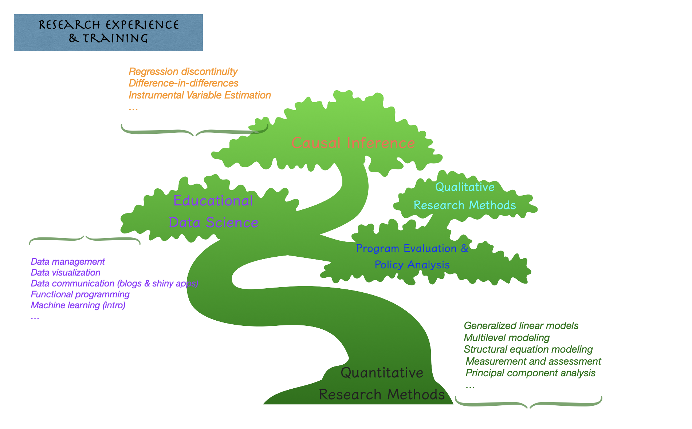

---
## What do I have
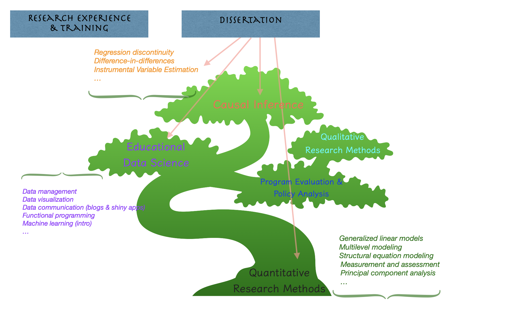

---
## What do I have
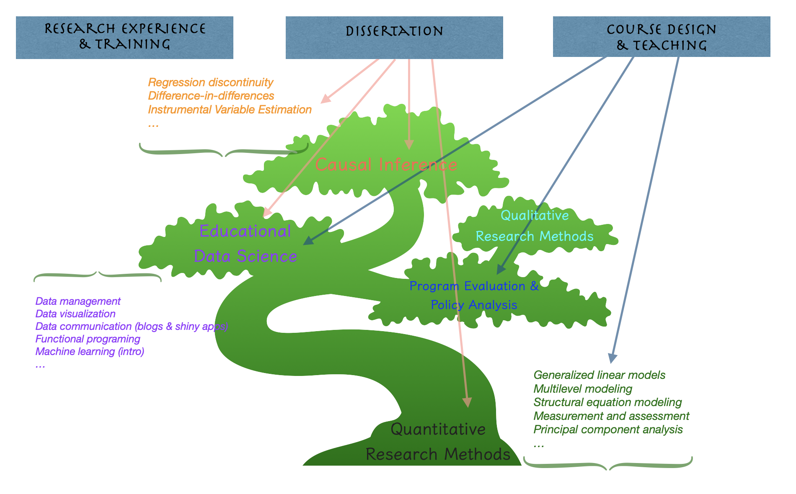

---
## Why am I here

Faculty position in general is purposeful and fulfilling for me
 - Research, sharing my findings and knowledge, adding to our understanding of education
 - Inspiring and motivating people who are experts in their content areas making change in the world
 
Two unique comoponents of this position perfectly align with my research competencies and career goal
 - Practice-oriented research and interdisciplinary collaborations 
   - My recent collaborations with experts from intervention science (course design, grant writing, shiny app ideas for their database) and teaching students from special ed and intervention science have been continuously adding to my research skills
 - Quantitative methods teaching is my specialty area and I'm excited to share my knowledge and contribute to the advancement of our academics and research here at Pacific U

---
class: center, middle
background-image: url(back02.png)
background-size: cover
# Paper 1: Gender Achievement Gaps and the Effects of Teacher-Student Gender Match

Authors: Congli Zhang and Anwesha Guha

Conference Paper | [Association for Education Finance and Policy](https://aefpweb.org/) | 2023, Denver 

---
## Why Studying Gender Achievement Gaps?

Girls have slowly and increasingly outperformed boys in school, particularly secondary classrooms (Gong et al., 2018), YET,

 - negative genders norms associate being a girl with lower ability to perform in math, STEM (Alan et al., 2018)

 - female students “remain much less likely to major in quantitative, technical, and science-related fields” (Bettinger & Long, 2005, p. 152), resulting in segregation in occupation and inequality of income in the long term

---
## Does Teacher-Student Gender Match Matter?

 - Positive effects:
   - Aaronson et al (2007) found that female teachers are more effective than male teachers and this difference derives from female students in Chicago public schools
   - Leveraging a natural experiment in China, Gong et al (2018) found positive impacts of female teachers on girls' academic outcomes across all subject areas
 - Null effects:
   - Cho (2012) estimated math and science data from 15 OECD countries and found that, in most countries, neither boys nor girls benefit from gender match
   - Holmlund and Sund (2008) found no match effect in Swedish high schools
 - Negative effects:
   - Antecol et al (2015) found that having a female teacher lowers the math test scores of female primary school students in disadvantaged neighborhoods
 
---
## Cautions in Estimating Gender Gap and Match Effects

Chetty et al's (2014) quasi-experimental estimates of bias have shown that, .highlighter02[the traditional model that only accounts for same-subject prior score yields biased estimates], 

 - adding same- and other-subject scores from the prior year is a considerable improvement and can be considered unbiased (e.g., Blazar & Kraft,  2017; Chetty et al., 2014; Kane et al., 2008; Kraft, 2019; Papay & Kraft, 2015)
 - adding more measures such as aggregates of prior achievement at classroom or school level also improves, but very little, from adding same and other subject prior scores
 
 
Holmlund and Sund (2008) warned researchers that, because teacher professions is female dominated, 

 - .highlighter02[match effects are confounded by gender achievement gap and the share of female teachers in the workforce]


---
## Research Questions

.highlighter01[What are the gender achievement gaps in core content areas such as language and math?]

.highlighter01[Whether and to what extent having a same-gender teacher affects students academic outcomes?]

---
## Data and Measures: Analytic Sample
Both of the two papers today are conducted in the population of Chinese junior high school (g7-9) students due to the national trend of random teacher-student assignment in China 

Analytic sample: 

 - drawn from the first nationally representative, two-wave (2013/14, 2014/15) data, China Education Panel Survey (CEPS)
 - student-level
 - separate for Chinese (language arts), English (nationally mandated second language), and math
 - limited to schools that were public schools, reported random assignment, and did not allow for within-school sorting 
    - because within-school sorting will bring considerable bias to the estimation 
    - less worried about cross-school sorting (school fixed-effects in our model absorb any time-invariant factors driving cross-school sorting) 

---
## Data and Measures: Key Variables

 - Predictor variable
   - dummy variable coded one for students who were taught by same-gender teacher and zero otherwise
 - Outcome variables
   - student wave 2 score (obtained from school record) and subject-specific self-concept (self-report)
   - both standardized to have a mean of zero and standard deviation of one within school

.highlighter04[

 - Covariates
   - student-level: student wave 1 scores in all subjects and demographic characteristics
   - homeroom-level: average characteristics of students' peers
   - teacher-level: teacher age, education attainment, experience, and indicator for homeroom advisor
   
]

(Predictor and outcome variables summary statistics table in Appendix)
---
## Visualizing Gender Gaps
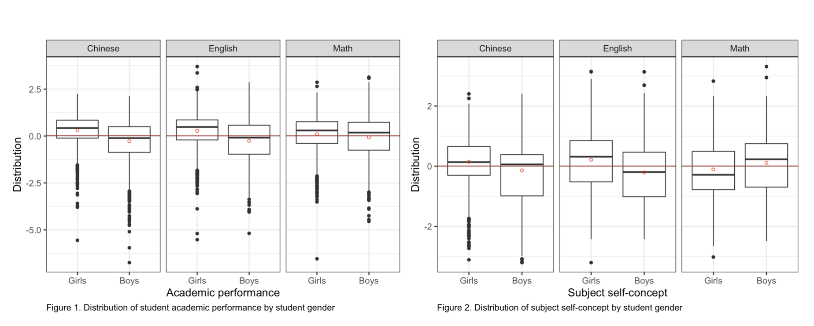

.highlighter04[

If girls really outperform boys in math, why they report lower self-concept than boys?

Is it possible that gender gap in math will change after accounting for other subjects achievements, like advocated by Chetty et al. (2014)?

]

---
## Method: Identification Strategy

Natural experiment condition:
 - Chinese junior high schools are regulated by the 2006 Compulsory Education Law as well as local education agencies
 - Randomly assign students into homerooms then teachers to homerooms (students in a homeroom share a same schedule and teachers rotate to homeroom to teach)
 - 83% of schools in a national survey reported random assignment
 - A balance check in the following slide confirms this random teacher-student assignment

---
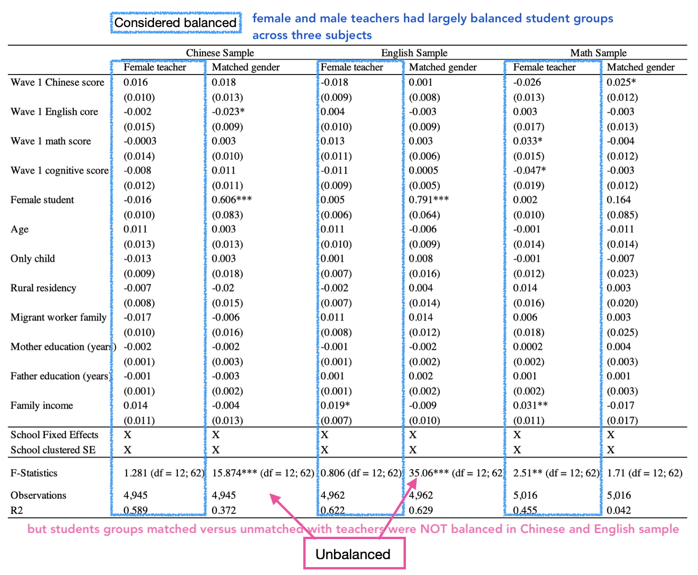

---
## Visualizing matching in different subject areas

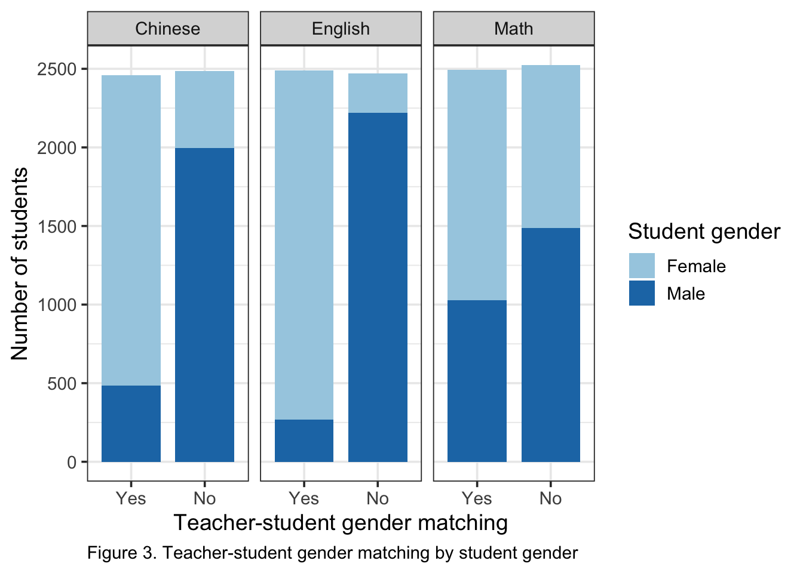

.highlighter04[

 - We observe much larger proportion of girls taught by same-gender teachers in Chinese and English subject areas, likely due to larger share of female teachers in the workforce

 - taking together that girls outperform boys in these two subjects, we conclude that teacher-student gender-match is confounded by achievement gap, therefore is an endogenous predictor (Holmlund & Sund, 2008): a predictor that is correlated with countless omitted variables that also impact student outcomes.
 
 - Simply regressing outcome variable on the indicator of gender-match will not recover causal effect
 
]

---
## Method: Estimation Strategy

To estimate gender gap, we fit a value-added, linear model using ordinary least squares (OLS) regression, separately for each of the three subjects, and importantly, .highlighter02[in the preferred model specification, we account for wave 1 scores in same and other subjects]: 

$$OUT_{it} = \beta_0 + \beta_1(GIRL_{i}) + \beta_2X_{i,t-1} + \beta_3H_{j,t-1} + \beta_4J_{j,t-1} + \theta_s + \epsilon_{i}$$

.highlighter04[

 - $OUT_{it}$ is the standardized score or self-concept of student $i$, taught by teacher $j$ (i.e., homeroom $j$), in school $s$, in year $t$ (wave 2)
 - $GIRL_{i}$ indicator of female student
 - $X_{it-1}$ is a vector of student $i$'s Chinese, English, math, and cognitive test scores and demographic characteristics in year $t-1$ (wave 1)
 - $H_{jt-1}$ is a vector of average characteristics of student $i$'s homeroom peers in year $t-1$ (wave 1)
 - $J_{jt-1}$ is a vector of teacher $j$'s characteristics in year $t-1$ (wave 1)
 - $\theta_s$ is school fixed-effects
 - Standard errors are clustered at the school level to account for the within-school correlations among residuals, $\epsilon_{i}$
 - $\beta_1$ is the coefficient of interest
 
]
 
---
## Method: Estimation Strategy (cont'd)

To estimate gender-match effects, we fit a value-added linear model using OLS regression, separately for each of the three subjects, .highlighter02[separately for girls and boys], and in the preferred model specification, account for scores in same and other subjects as well as all student-, homeroom-, and teacher-level covariates from wave 1:

$$OUT_{it} = \beta_0 + \beta_1(MATCH_{i}) + \beta_2X_{i,t-1} + \beta_3H_{j,t-1} + \beta_4J_{j,t-1} + \theta_s + \epsilon_{i}$$
.highlighter04[

 - $OUT_{it}$ is the standardized score or self-concept of student $i$, taught by teacher $j$ (i.e., homeroom $j$), in school $s$, in year $t$ (wave 2)
 - $GIRL_{i}$ indicator of being taught by a same-gender teacher
 - $X_{it-1}$ is a vector of student $i$'s Chinese, English, math, and cognitive test scores and demographic characteristics in year $t-1$ (wave 1)
 - $H_{jt-1}$ is a vector of average characteristics of student $i$'s homeroom peers in year $t-1$ (wave 1)
 - $J_{jt-1}$ is a vector of teacher $j$'s characteristics in year $t-1$ (wave 1)
 - $\theta_s$ is school fixed-effects
 - Standard errors are clustered at the school level to account for the within-school correlations among residuals, $\epsilon_{i}$
 - $\beta_1$ is the coefficient of interest
 
]
 
---
### Results: Gender Achievement Gaps
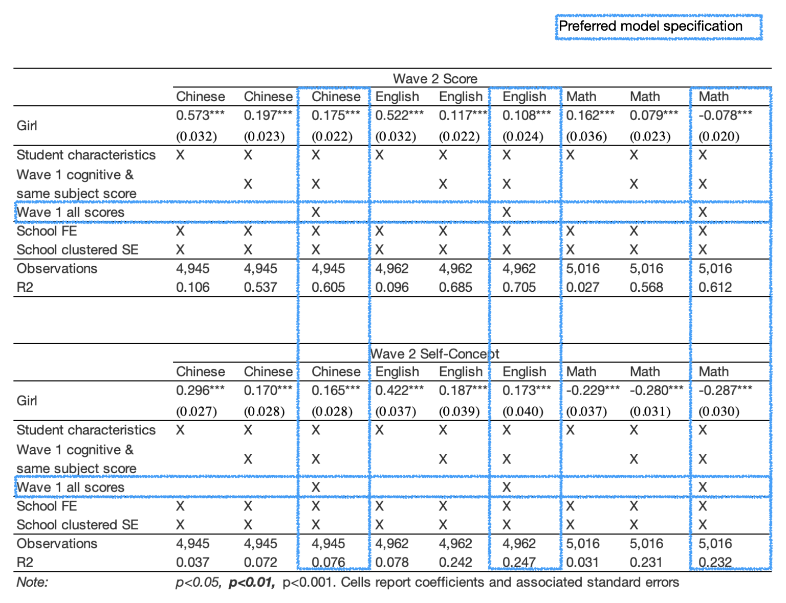

---
### Results: The Effects of Teacher-Student Gender-Match for Girls
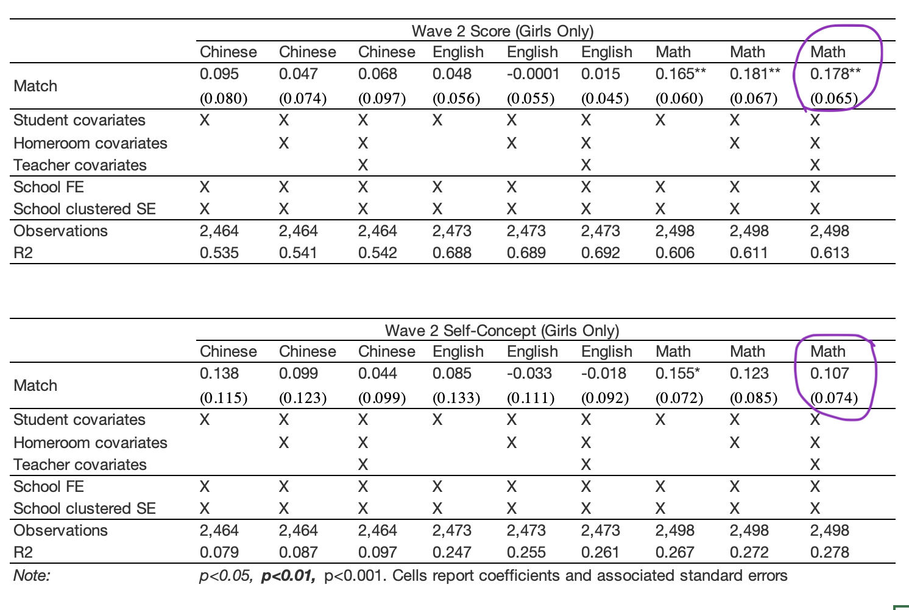

---
### Results: The Effects of Teacher-Student Gender-Match for Boys
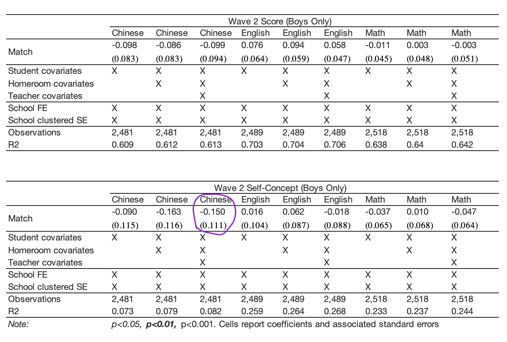

---
### Results: Visualizing the Effects of Teacher-Student Gender-Match
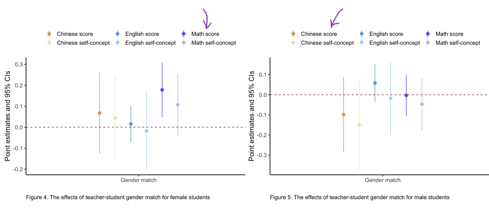

---
### Biased Estimates 
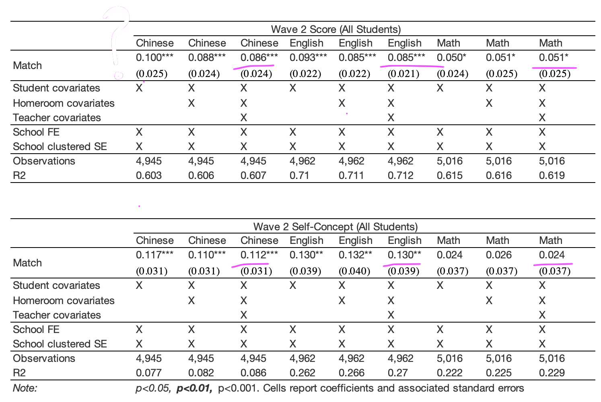

---
## Discussion: Finding 1

Summary of findings:

 - Compared to boys in the same school, girls have higher score and self-concept in language areas including Chinese and English, but lower score (-0.078 SD) and self-concept (-0.287 SD) in math
 
 - Taught by a same-gender teacher over a school year 
   - raises girls' math score (0.178 SD) and self-concept (0.107 SD) but no effect on girls' language outcomes 
   - has no effect on boys, except for curbing boys' self-concept in Chinese (although the estimate was imprecise)

---
## Discussion: Finding 2

Methods matter in estimating gender effects:

 - Accounting for other subject scores significantly absorb bias (e.g., motivation, learning ability, family inputs, etc.)
   - in China's case, fail to do so results in misleading results

 - Even under random assignment condition, match is an endogenous predictor of achievement
   - Gender matching is likely not random when two things coincide: a certain student gender is more likely to be matched and there is a gender achievement gap - like girls outperforming boys in Chinese and English
   - Solution is to either estimate girls and boys separately or use the interaction between student gender and match, but research questions are different and interpretations are complex for the latter
      
---
## Discussion: Implications and Future Directions

Interpretation of the findings:
 - We raise researchers' attention on the two methodological issues raised by researchers (Chetty et al., 2014; Holmlund and Sund, 2008) and confirmed in this paper
 - Also attention to the substantive finding that 
   - girls lag behind boys in math (in junior high/middle school) and the fact that they benefit from female math teachers
   - So we suggest to put the strengthening of female workforce in STEM on the agenda of school reform, but be aware that gender match alone cannot address systemic inequity, especially without taking intersectionality of identity into account (Rezai-Rashti & Goli, 2010)
   
Limitations and future directions
 - Boys lag behind in language subjects but the underlying mechanisms through which schools and teachers may mitigate this issue remain unclear

---
class: center, middle
background-image: url(back02.png)
background-size: cover
# Paper 2: Teacher-Student Relationships, Student Academic Outcomes, and the Role of Teacher-Advisors

(Dissertation second article; manuscript available on my academic website) 

---
## Research Significance

The benefits of teacher-student relationships (TSRs) have been well theorized from attachment, motivation, and sociocultural perspectives (Davis, 2003; Roorda et al., 2011)

Researchers have long observed that positive TSRs are associated with reduced disciplinary problems (Crosnoe et al., 2004), enhanced psychological engagement and school attachment (Quin, 2017), and increased academic performance (Lee, 2012)

The overall correlations between positive TSRs and better student outcomes were found to be medium to large in several systematic literature reviews (e.g., Christensen, 1960; Cornelius-White, 2007; Quin, 2017; Roorda et al., 2011)

---
### Are the Observed Relations between TSRs and Outcomes Causal?

Roorda et al. (2011) reviewed 99 studies and found that most of them used cross-sectional designs and none supported causal inference. Similarly in the other two literature review studies, Cornelius-White (2007) and Quin (2017)
 
Two fundamental issues to causal identification of TSR effects:
 - Omitted variable bias
 - Reverse causality

At-scale randomized controlled trial is near-impossible 
 - Expensive, unethical
 - Estimation is often biased even under random teacher-student assignment condition because of the difficulty to assign teachers and students to different levels of TSR as well as the reverse causality after the assignment

---
## My Quasi-Experimental Design

Different levels of TSR are defined (statistically identified) by an exogenous shock (an instrumental variable) rather than the self-selection of teachers and students
 - I leverage a comparison condition in China that whereas some students are taught by traditional teachers, others are taught by teacher-advisors
 - taking together the random teacher-student assignment discussed in paper 1, being taught by teacher-advisor is randomly assigned to students rather than through self-selection

This instrumental variable estimation (IVE, e.g., Angrist et al., 1996; Angrist & Krueger, 2001; Baiocchi et al., 2014; Bound et al., 1995; Staiger & Stock, 1997) approach
 - is arguably one of the best alternatives to education experiments 
 - and importantly, makes it possible to conduct at-scale using observational data 

---
## Research Questions

.highlighter01[What are the effects of being taught by teacher-advisor on teacher-student relationships and academic outcomes?]

.highlighter01[Whether and to what extent teacher-student relationships affect student academic outcomes?]

---
## Background and Data

**Mostly similar to Paper 1 so won't repete here.**

Key variables

 - Predictor variable: TSR
   - measured by three survey items asking students' rating on teacher's praise, attention, and questioning in classroom
   - A principal component analysis (in manuscript) justifies the use of the mean of the three variables in my main analysis (PCA composite in robustness checks)
   - standardized at school level
 - Instrumental variable
   - dummy variable coded one for students who were taught by teacher-advisor and zero otherwise
 - Outcome variables and covariates are identical to those in paper 1
 
(Summary statistics table in Appendix)

---
## Identification Strategy

I conduct wave 1 covariates balance check (similar approach in paper 1) and shows balanced student groups taught by advisor and non-advisor teachers in all three subjects (table is in Appendix, discussions in manuscript)

In other words, the IV, taught by advisor, is considered randomly assigned to students

---
## Estimation Strategy

IVE Intuition: 
 - I leverage the random assignment of IV to identify a portion of variance in TSR that was uncorrelated with potential outcomes and use only this portion (rather than the endogenous TSR) to obtain asymptotically unbiased estimates of TSR effects on student academic outcomes 

Two-Stage Least-Squares (2SLS) Estimator:
 - The two stages including first stage (the effects of IV on predictor) and second stage (the effects of exogenously identified predictor on outcome)
 - My IV largely meets three critical assumptions (detailed discussions in manuscript)
   - exogeneity
   - relevance (warranted in language subjects - Chinese and English, but not math)
   - exclusion restriction

---
## Model Specifications

To recover the causal impacts of TSR on student academic outcomes, I fit a value-added, two-stage least-squares (2SLS) regression, separately for each of the two subjects (Chinese and English):

Stage 1:

.highlighter04[

$$TSR_{ijt} = \alpha_g(g(A_{i, t-1})) + \alpha_1(ADVISOR_{jt}) + \alpha_2X_{i,t-1} + \alpha_3H_{j,t-1} + \alpha_4J_{j,t-1} + \theta_s + \delta_{i}$$
]

Stage 2:

.highlighter04[

$$OUT_{it} = \beta_g(g(A_{i, t-1})) + \beta_1(\hat{TSR}_{ijt}) + \beta_2X_{i,t-1} + \beta_3H_{j,t-1} + \beta_4J_{j,t-1} + \theta_s + \epsilon_{i}$$

]

.highlighter04[

 - 
 - $\hat{TSR}_{ijt}$ is the predicted value of TSR by IV in the first stage
 - both stages account for the same sets of covariates and control for school fixed-effects and cluster standard errors at school level
 - in the preferred model specification, I account for cubic functions of scores as well as all student-, homeroom-, and teacher-level covariates from wave 1 to improve estimation precision (my IV is a weak instrument, even though it does not bias the estimates, it likely will inflate standard errors)
 - $\beta_1$ is the coefficient of interest
 
]

---
### Results 1: The Effects of Teacher-Advisors 

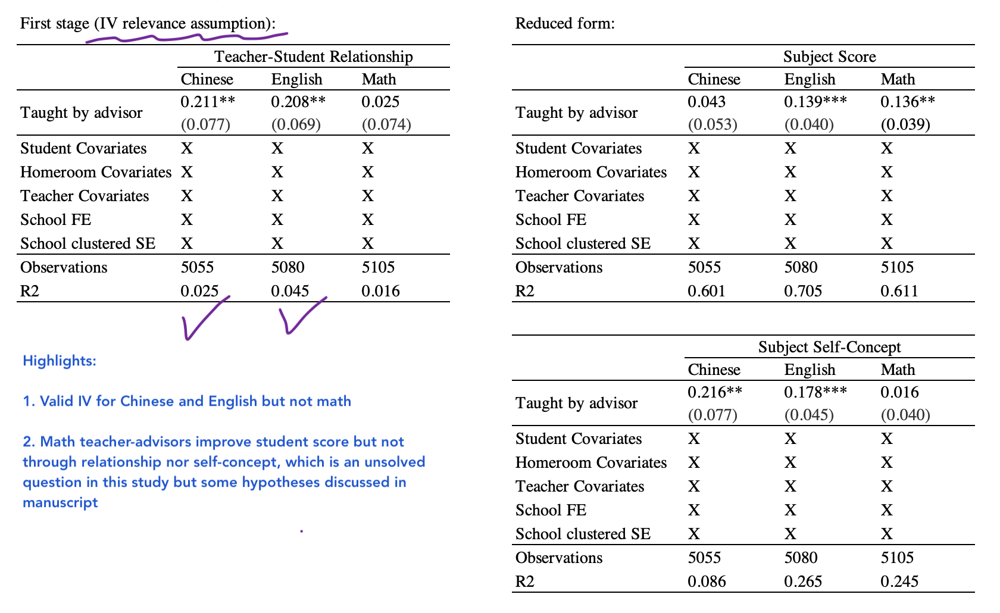

---
### Results 2: The Effects of Teacher-Student Relationships by 2SLS

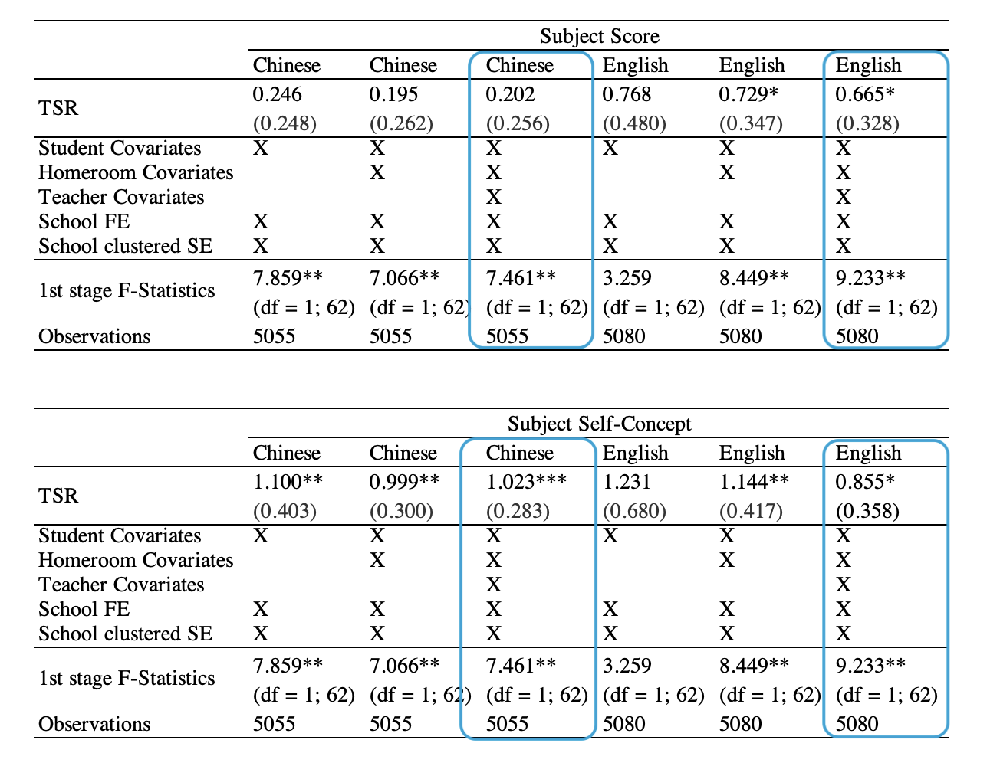

---
### Comaprison: naive (biased) estimates by OLS regression
None of the coefficients should be interpreted as causal - even though they are consistent with the finding in the literature, which are mostly correlational rather than causal

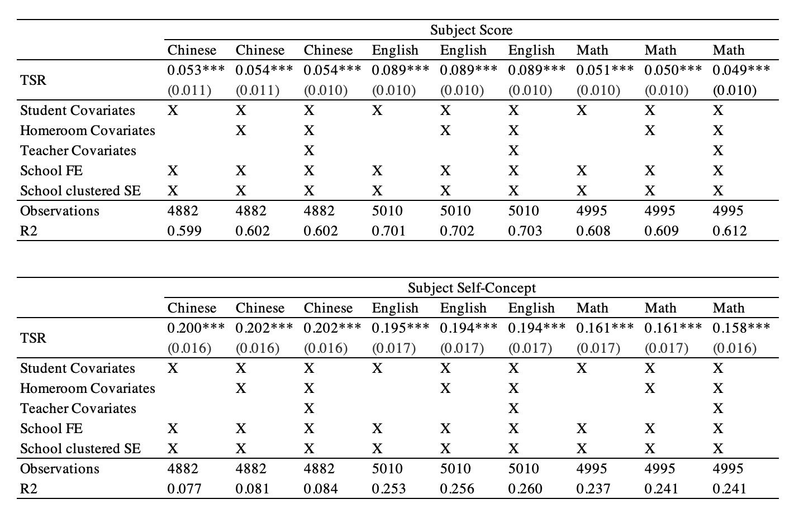

---
## Discussion

Summary of findings:

 - In language classrooms such as Chinese and English,
    - the national policy initiative in China, assigning a formal advisor role to a core content teacher, significantly improves classroom TSR as well as student self-concept
    - the enhanced TSR because of being taught by advisor significantly improved students' English score and self-concept in both Chinese and English; the increase in Chinese score is also educational meaningful but the estimate was imprecise
    - in sum, TSR matters in language classrooms and assigning teachers additional advising role enhances relationship and outcome
 
 - In math classroom,
   - taught by advisor improved score outcome but not relationship nor self-concept
   - the effect of TSR on student outcomes remains unknown
   
---
## Implications and Future Directions

In interpreting the results:

 - My findings confirm that the observed associations between TSR and student performance in Chinese and English classrooms are indeed causal
   - Relationship-building practices and policy initiatives are promising in terms of improve student learning

 - Math teachers may impact students through channels beyond relationship-building
   - Future direction is to understand more about the mechanisms through which math teacher affect student outcomes 
   - A caution in mind is that the naive estimates of the relations between TSRs and math outcomes cannot be interpreted as causal
   
 - TSR effects are localized around the IV and different IV may result in different estimates
   - Future research using different IV or experimental design will be helpful to check the robustness of my findings

---
class: center, middle
background-image: url(back01.png)
background-size: cover

## Thank you for your time!

### Questions and Feedback

Academic website: *congliclairezhang.com* 

(CV, paper 2 manuscript, today's slides, etc.)

Email: *congliclairezhang@gmail.com*


---
### References

.highlighter04[

Aaronson, Barrow, L., & Sander, W. (2007). Teachers and Student Achievement in the Chicago Public High Schools. Journal of Labor Economics, 25(1), 95–135. https://doi.org/10.1086/508733

Alan, Ertac, S., & Mumcu, I. (2018). Gender Stereotypes in the Classroom and Effects on Achievement. The Review of Economics and Statistics, 100(5), 876–890. https://doi.org/10.1162/rest_a_00756

Angrist, Imbens, G. W., & Rubin, D. B. (1996). Identification of Causal Effects Using Instrumental Variables. Journal of the American Statistical Association, 91(434), 444–455. https://doi.org/10.1080/01621459.1996.10476902

Angrist, & Krueger, A. B. (2001). Instrumental Variables and the Search for Identification: From Supply and Demand to Natural Experiments. The Journal of Economic Perspectives, 15(4), 69–85. https://doi.org/10.1257/jep.15.4.69

Antecol, Eren, O., & Ozbeklik, S. (2015). The effect of teacher gender on student achievement in primary school. Journal of Labor Economics, 33(1), 63–89. https://doi.org/10.1086/677391

Baiocchi, Cheng, J., & Small, D. S. (2014). Instrumental variable methods for causal inference. Statistics in Medicine, 33(13), 2297–2340. https://doi.org/10.1002/sim.6128

Bettinger, & Long, B. T. (2005). Do faculty serve as role models?: The impact of instructor gender on female students. The American Economic Review, 95(2), 152–157. https://doi.org/10.1257/000282805774670149

]

---
### References (cont'd)

.highlighter04[

Bound, Jaeger, D. A., & Baker, R. M. (1995). Problems with Instrumental Variables Estimation when the Correlation between the Instruments and the Endogenous Explanatory Variable is Weak. Journal of the American Statistical Association, 90(430), 443–450. https://doi.org/10.1080/01621459.1995.10476536

Cho. (2012). The effect of teacher–student gender matching: Evidence from OECD countries. Economics of Education Review, 31(3), 54–67. https://doi.org/10.1016/j.econedurev.2012.02.002

Christensen, C. M. (1960). Relationship between pupil achievement, pupil affect-need, teacher warmth, and teacher permissiveness. Journal of Educational Psychology, 51(3), 169–174. https://doi.org/10.1037/h0044666 

Cornelius-White, J. (2007). Learner-Centered Teacher-Student Relationships Are Effective: A Meta-Analysis. Review of Educational Research, 77(1), 113–143. https://doi.org/10.3102/003465430298563

Crosnoe, Johnson, M. K., & Elder, G. H. (2004). Intergenerational bonding in school: The behavioral and contextual correlates of student-teacher relationships. Sociology of Education, 77(1), 60–81. https://doi.org/10.1177/003804070407700103

Davis. (2003). Conceptualizing the Role and Influence of Student-Teacher Relationships on Children’s Social and Cognitive Development. Educational Psychologist, 38(4), 207–234. https://doi.org/10.1207/S15326985EP3804_2

Gong, Lu, Y., & Song, H. (2018). The effect of teacher gender on students’ academic and noncognitive outcomes. Journal of Labor Economics, 36(3), 743–778. https://doi.org/10.1086/696203

Holmlund, & Sund, K. (2008). Is the gender gap in school performance affected by the sex of the teacher? Labour Economics, 15(1), 37–53. https://doi.org/10.1016/j.labeco.2006.12.002

]


---
### References (cont'd)

.highlighter04[

Lee. (2012). The effects of the teacher–student relationship and academic press on student engagement and academic performance. International Journal of Educational Research, 53, 330–340. https://doi.org/10.1016/j.ijer.2012.04.006 

Quin. (2017). Longitudinal and Contextual Associations Between Teacher-Student Relationships and Student Engagement: A Systematic Review. Review of Educational Research, 87(2), 345–387. https://doi.org/10.3102/0034654316669434

Rezai-Rashti, Goli M., and Wayne J. Martino. “Black Male Teachers as Role Models: Resisting the
Homogenizing Impulse of Gender and Racial Affiliation.” American Educational Research Journal
47, no. 1 (March 2010): 37–64. https://doi.org/10.3102/0002831209351563

Roorda, Koomen, H. M. Y., Spilt, J. L., & Oort, F. J. (2011). The Influence of Affective Teacher-Student Relationships on Students’ School Engagement and Achievement: A Meta-Analytic Approach. Review of Educational Research, 81(4), 493–529. https://doi.org/10.3102/0034654311421793 

Staiger, & Stock, J. H. (1997). Instrumental Variables Regression with Weak Instruments. Econometrica, 65(3), 557–586. https://doi.org/10.2307/2171753

]


---
### Appendix


---

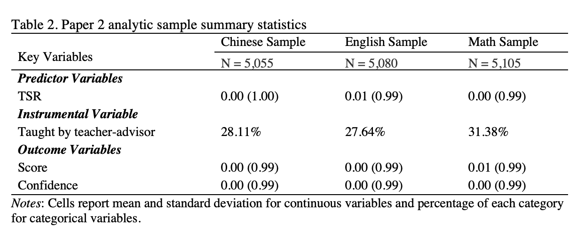

---


