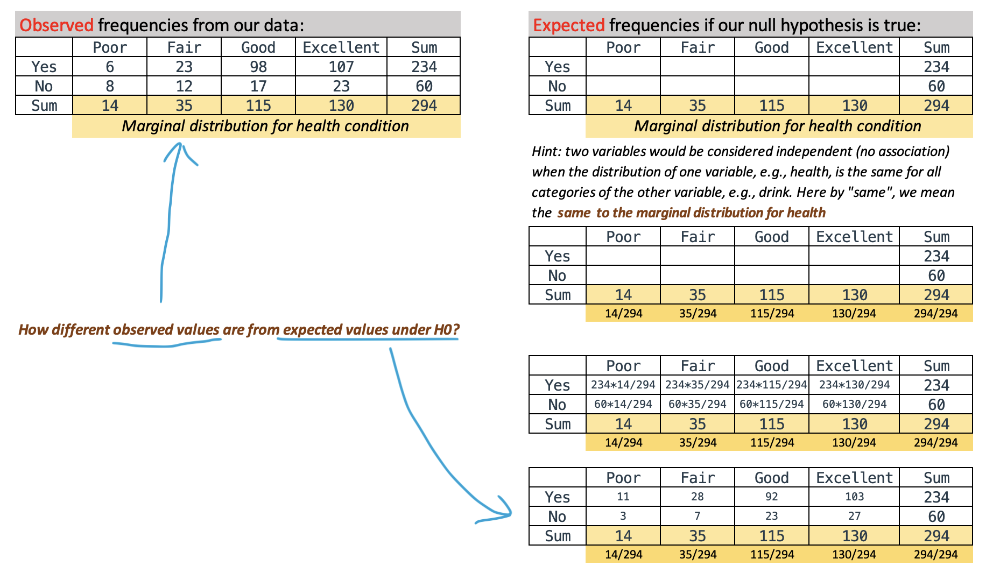
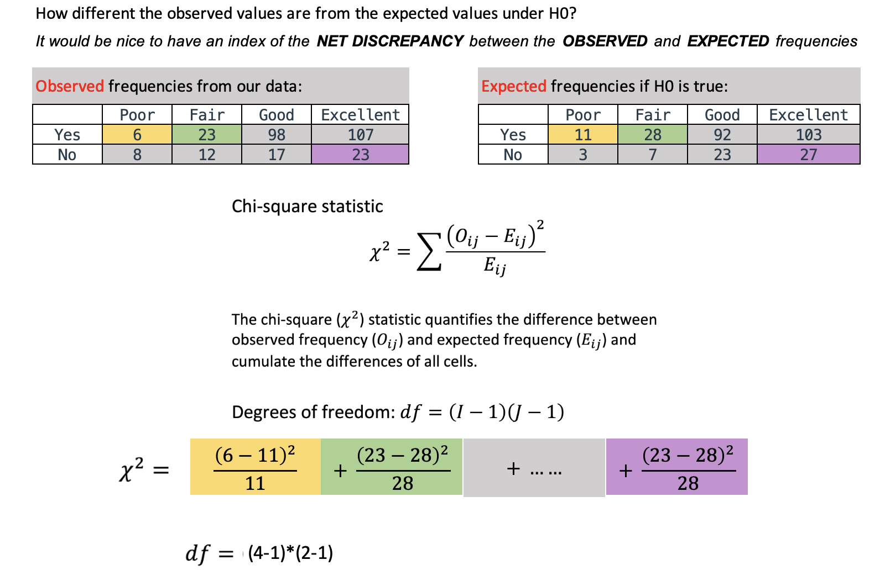

```{r setup, include=FALSE}
options(htmltools.dir.version = FALSE,
        include = TRUE)
xaringanExtra::use_editable(expires = 1)
```

```{r xaringan-themer, include=FALSE, warning=FALSE}
pacman::p_load(xaringanthemer, tidyverse, dplyr)
style_mono_light(base_color = "#3b586c",
                 base_font_size = "20px",
                 header_h1_font_size = "2.10rem",
                 header_h2_font_size = "1.80rem")
```

### Learning Objectives

 - Describe relationships between variables that are categorical with ordinal or nominal scales

   - Two-way contingency tables
   - Grouped bar charts
 
 - Test the relationship between two categorical variables using **Chi-square Test of Independence**
 
 - Chi-square test assumptions
 
 - Make statistical inference from a Chi-square statistic
 
(*This mini course is designed based on the statistics course materials from Dr. David Liebowitz and Dr. Cengiz Zopluoglu at the University of Oregon*)

---
### Prerequisites

I assume you have learned these statistical concepts:

 - Levels of measurement
 
 - Central Limit Theorem 
 
 - Hypothesis testing procedure
 
   - Check assumptions and write the null hypothesis
   - Calculate the test statistic
   - Determine the p-value
   - Make a decision whether to reject the null 
   - Make statistical inference

---
### Motivating Research Question

.highlighter02[Whether there is a significant relationship between drinking and health?]

Suppose the toy data below is drawn from my population of interest, say, the adults in the state of Oregon. 


```{r, echo = FALSE}
df <- readxl::read_excel(here::here("./1_presentation/teaching-example/toy.xlsx")) %>% 
  select(Drink = drink, Health = health) %>% 
  mutate(Drink = factor(Drink, levels = c("yes", "no"), labels = c("Yes", "No")),
         Health = factor(Health, levels = c("poor", "fair", "good", "excellent"), labels = c("Poor", "Fair", "Good", "Excellent"))) %>% 
  drop_na()

head(df, 6)
```

Putting into words:
 - Our data contains ... observations and ... variables,"Drink" and "Health". Both variables are .... (categorical or continuous).
 
---
### Summarize each variable

Recall when summarize a categorical variable, we usually use counts and percentages

```{r, echo = FALSE}
modelsummary::datasummary_skim(df, type = "categorical")
```

Putting summary statistics into words: 

 - There are .... observations in the data. The variable "Drink" has ... categories, the category of "Yes" has ... observations, which is ... percent of the sample, the category of "No" has .... 
 
 - Similarly for the variable "Health", ....

---
### Describe categorical relationship: two-way contingency table

```{r, echo = FALSE}
addmargins(table(df$Drink, df$Health, dnn = c("Drink", "Health")))
```

Putting the table into words:
 - In our sample of Oregon adults who do not drink, ......; in those who drink, ......


---
### Describe categorical relationship: grouped charts

```{r, echo = FALSE, fig.height=4.8}
ggplot(df, aes(x = Health, fill = Drink)) +
  geom_bar(position = "dodge", alpha = 0.7) + 
  xlab("Health condition") +
  ylab("Number of individuals") +
  theme_bw(base_size = 12)
```

Putting the plot into words:
 - Within each health condition, there are more people who... than people who ..., except for people who have a poor health condition, there are more more people who... than people who ...
 
---
### Whether there is a significant relationship between drinking and health?

Null hypothesis

 - $H_0$: Drinking is not associated with health condition, in the population of Oregon adults.
 - $H_a$: Drinking is associated with health condition, in the population of Oregon adults.
 
---
### What does our $H_0$ mean in the contingency table?



---
### The Chi-square $\chi^2$ statistic


---
### Evaluate $H_0$ (compare p-value and alpha threashold)

Intuition:

 - Since $\chi^2$ measures the net discrepancy between our data observed and expected under $H_0$, a $\chi^2$ of zero or close suggests no relationship between drink and health. 
 - But how to statistically define what is big, what is close to zero?

statistical approach:

 - One way is to take our $\chi^2$ and $df$ to plug in [some online calculator](http://onlinestatbook.com/2/calculators/chi_square_prob.html) to get the p-value

---
### Evaluate $H_0$ (cont'd)

The other way is to formally conduct chi-square testing in with a statistical software, R, in today's case

```{r, echo = FALSE, warning = FALSE}
chisq.test(df$Drink, df$Health)
```

Putting the Chi-square testing results into word:

"A Chi-square test was conducted to test whether or not there is a significant relationship between drinking and health condition in the population of Oregon adults. The findings indicated that there was a significant relationship between drinking and health condition, $\chi^2$ = 18.611, p < .001." 

---
### Chi-square test assumptions

 - Observations are independent.
 
 - The same individual cannot appear or be counted in multiple cells
 
 - For 2X2 table, all expected frequencies are above 5

 - For a larger table, all expected frequencies are above 1 and no more than 20% of all cells have expected frequencies less than 5
 
 - If these assumptions do not hold, then the distribution does not follow a [chi-square distribution](https://www.jmp.com/en_ca/statistics-knowledge-portal/chi-square-test/chi-square-distribution.html) and the p-values are not valid


---
### Reminder of basic steps conducting classical statistical inference

 - State a research question, including a null hypothesis which states there exists no relationship between our variables of interest

 - Display and describe the observed data

 - Summarize (using a statistic such as $\chi^2$ today) the observed data in relationship to an expected value under the null hypothesis

 - Set a threshold at which we will no longer believe that the discrepancy between the observed and expected relationship is due to sampling idiosyncrasy

 - Estimate the p-value

 - Reject or fail to reject the null hypothesis

 - Interpret findings drawing on test statistics as well as plots and summary statistics 
 
---
### Self-evaluation your learning today

 - Describe relationships between variables that are categorical with ordinal or nominal scales

   - Two-way contingency tables
   - Grouped bar charts
 
 - Test the relationship between two categorical variables using **Chi-square Test of Independence**
 
 - Chi-square test assumptions
 
 - Make statistical inference from a $\chi^2$ statistic

---
class: center, middle
background-image: url(back01.png)
background-size: cover

# Q & A


